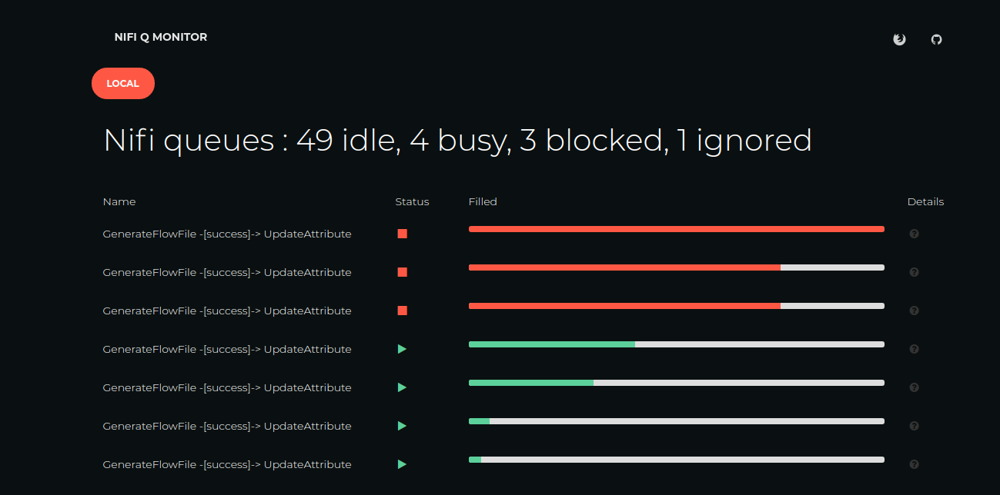

# Apache NIFI Queue monitor

## The problem
When using Apache NIFI to do some data transfer/transformation/processing, you will end up with several queues.

I typically use a pattern with a "normal" flow, and then queues that gather things to retry and eventually fail.
This pattern has the advantage that when something does not go as initially planned, I get a visual notification
(the error queue is not empty)... I have access to both the content and the attribute of the violation and 
after I fixed the thing, I can reintroduce the files so that no data is lost.

Only downside : I do not want to keep a constant lookout for queues filling up, so I wanted to automate that.

## Automation
When doing some searching, I
came up with the some proposals of using the REST API from within NIFI ([link1](https://community.cloudera.com/t5/Community-Articles/NiFi-REST-API-FlowFile-Count-Monitoring/ta-p/244208#comment-170948) and
[link2](https://community.cloudera.com/t5/Support-Questions/NiFi-queue-monitoring/td-p/212335)). But both this
would mean that (like the forum posters indicate) you would need to configure 100's of monitoring jobs.

Second issue : I do not care about queues filling up : they're made for that. I'm concerned about things getting
stuck in a queue, that is, there is no automated retry/fix taking care of the problem. So just adding lots of 
thresholds is not what we need : a queue with 5.000 elements can be perfectly ok, until 1 element is tossed
into an error queue... it's the queue with 1 element that merits my attention.

Also, I do not like push messages... I'm already spammed as it is, thank you for not sending me more email to
tell me a queue has passed its threshold. I want state and things that clear themselves once the problems is
solved.

## My approach

So instead of configuring within NIFI a monitoring with specific thresholds per queue and lot's of messages, this
project creates a standalone service that polls the NIFI REST-API on a regular (configurable basis). It then
inspect all queues, and determines the status.

At the moment 4 states are defined :
* ignored : you're not interested in this queue
* idle : the queue is empty
* busy : there is data in the queue, but there are messages flowing out of the queue in the last 5 minutes (the nifi aggregation interval)
* blocked : there is data in the queue and the number of messages flowing out is 0

Only the busy and the blocked queues are shown (to keep the UI not overloaded). You can click on the details
and it will open up NIFI (so no need to search your way 5 levels down in the UI to find the )

The overall status of the server is shown at the top in a nice colorful indication of the state. The processed
information is exposed as REST (/servers/) so that you may integrate this in some health check monitoring application
as well if you have it.

Here is a screenshot of how it looks 


As you can see the server "local" is in state blocked (red). There are 3 queues that are blocked (red) and 4 that are 
just busy (green). Idle and ignored queues are not shown (since not interesting and potentially some 100s)

The progress bar indicates the current fill level (maximum of number of files and queuesize). 

## Deployment & configuration
There is a [docker image](https://github.com/kullervo16/nifi-queue-monitor) available. You only just need to provide a configuration XML file and (optionally) 
change some environment variables.

Here is an example of the XML config file

```
<config>
    <server url="http://localhost:8080" name="local">
        <exclude id="81577ff6-016f-1000-ac25-832e410123d6"/>
    </server>
</config>
```

This file should be in ```/opt/config/configuration.xml``` (or at the location you set in the variable ```config.location```)
 
 You can change the configuration interval via environment variable : ```collection.interval.seconds```. The default value is 60 seconds.
 Since we only check the process groups, the impact on the NIFI is low (no queue content inspection required)

## Still to do 
* implement user management (for the moment only public instances can be handled)
* make sure in monitor instance can monitor several NIFI instances
